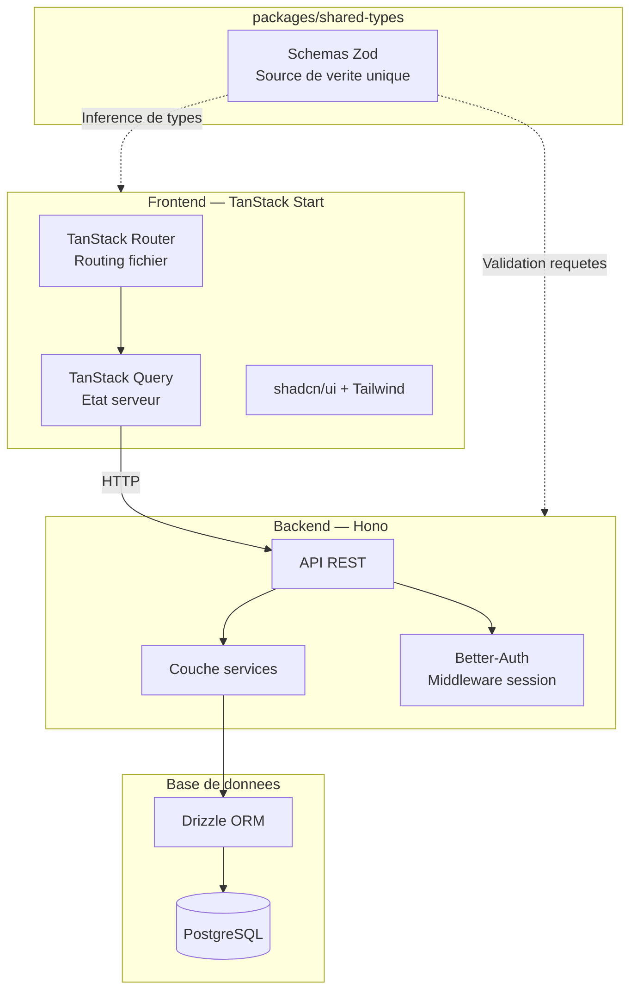

# HappySeeds

**Application de gestion de grainotheque et de planification des semis.**

[]()
[]()
[]()
[]()
[](LICENSE)

> [Read in English](README.md)

---

Application web fullstack personnelle destinee aux jardiniers souhaitant cataloguer leur collection de graines, consulter des fiches plantes et planifier leur calendrier de semis selon les donnees climatiques.

> **Note :** Ce projet personnel est en cours de developpement (version alpha). Certaines fonctionnalites sont encore en progression.

## Captures d'ecran

<!-- TODO: Ajouter les captures d'ecran ici -->
*A venir*

## Stack technique

| Couche | Technologie |
|--------|------------|
| **Monorepo** | Turborepo + pnpm |
| **Backend** | Hono |
| **ORM** | Drizzle ORM |
| **Base de donnees** | PostgreSQL |
| **Authentification** | Better-Auth (sessions) |
| **Frontend** | TanStack Start + TanStack Router |
| **Data Fetching** | TanStack Query |
| **Composants UI** | shadcn/ui + Radix UI |
| **Styles** | Tailwind CSS v4 |
| **Validation** | Zod (partage entre client et serveur) |
| **Langage** | TypeScript (mode strict) |

## Architecture



## Structure du projet

```
happyseeds/
├── apps/
│   ├── backend/              # Serveur API Hono
│   │   └── src/
│   │       ├── db/schemas/   # Definitions de tables Drizzle
│   │       ├── routes/       # Endpoints API REST
│   │       ├── services/     # Logique metier
│   │       └── middleware/   # Middleware d'authentification
│   └── frontend/             # Application TanStack Start
│       └── src/
│           ├── routes/       # Routing base sur les fichiers
│           ├── components/   # Composants UI
│           ├── hooks/        # Hooks TanStack Query
│           ├── services/     # Couche services API
│           └── lib/          # Utilitaires
├── packages/
│   └── shared-types/         # Schemas Zod partages entre client et serveur
└── scripts/                  # Outils (import, release)
```

## Decisions techniques cles

Ce projet privilegie deliberement des technologies que je n'avais pas ou peu pratiquees — l'objectif etait d'apprendre en construisant, pas de rester en terrain connu.

**Monorepo Turborepo** — Backend, frontend et types partages cohabitent dans un seul depot avec linting, formatage et verification de types unifies. Les schemas Zod partages assurent une securite de types de bout en bout : un schema unique valide les requetes API cote serveur et infere les types TypeScript cote client.

**TanStack Start + Router** — Choisi pour son routing type-safe base sur les fichiers et son integration etroite avec TanStack Query. L'ecosysteme TanStack offre une alternative moderne et bien concue, construite sur des bibliotheques eprouvees (Query, Router, Form) plutot que sur un framework tout-en-un.

**Drizzle ORM** — Approche legere, proche du SQL, avec une excellente inference TypeScript. Les migrations sont des fichiers SQL explicites, offrant un controle total sur le schema de la base de donnees — un flux de travail plus transparent par rapport au moteur de migration abstrait de Prisma.

**Hono** — Framework HTTP ultra-rapide et leger avec support TypeScript natif. Son systeme de middlewares s'integre naturellement avec Better-Auth pour l'authentification par sessions.

## Approche de developpement

Ce projet a ete construit avec une methodologie d'apprentissage assistee par IA. J'ai concu un skill `dev-mentor` — un ensemble de regles qui configure l'IA comme un **guide socratique** : elle explique les concepts, revoit les decisions architecturales, pose des questions et oriente vers la documentation, mais **n'ecrit jamais de code directement**.

Chaque ligne de code de ce depot a ete ecrite a la main. L'IA a servi de mentor, pas de co-pilote.

Cette approche m'a permis de comprendre en profondeur chaque choix technique tout en exploitant l'IA comme accelerateur d'apprentissage structure.

## Demarrage rapide

### Pre-requis

- Node.js >= 18
- pnpm >= 10
- PostgreSQL

### Installation

```bash
# Cloner le depot
git clone https://github.com/YOUR_USERNAME/happyseeds.git
cd happyseeds

# Installer les dependances
pnpm install

# Configurer les variables d'environnement
cp apps/backend/.env.example apps/backend/.env
cp apps/frontend/.env.example apps/frontend/.env
# Editer les fichiers .env avec vos identifiants de base de donnees

# Executer les migrations
cd apps/backend
pnpm drizzle-kit migrate
cd ../..

# Lancer les serveurs de developpement
pnpm dev
```

Le frontend tourne sur `http://localhost:3000` et l'API sur `http://localhost:3001`.

## Feuille de route

- [ ] Fonctionnalite de recherche dans les plantes et graines
- [ ] Upload d'images dans les formulaires de plantes
- [ ] Enrichissement des cas d'utilisation et workflows
- [ ] Refonte UI/UX
- [ ] Systeme de design visuel
- [ ] Plus de tests (unitaires, integration, e2e)

## Licence

[MIT](LICENSE) — Michel Maes

## Contact

**Michel Maes** — Developpeur Full Stack JS | Front-End Designer

[](https://linkedin.com/in/mic-maes)
