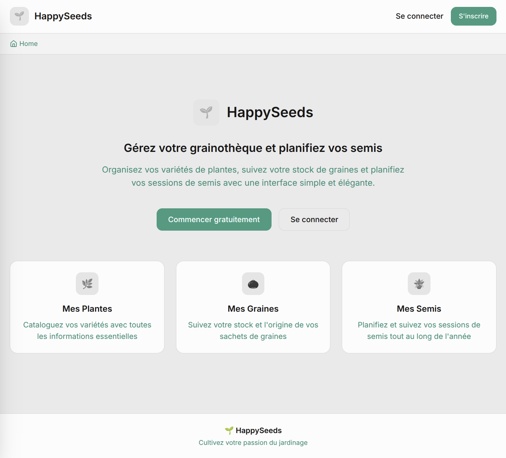
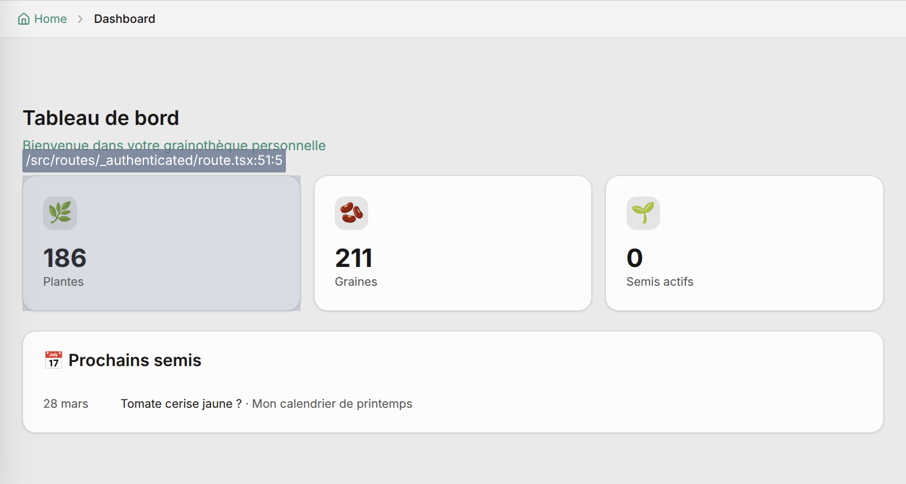
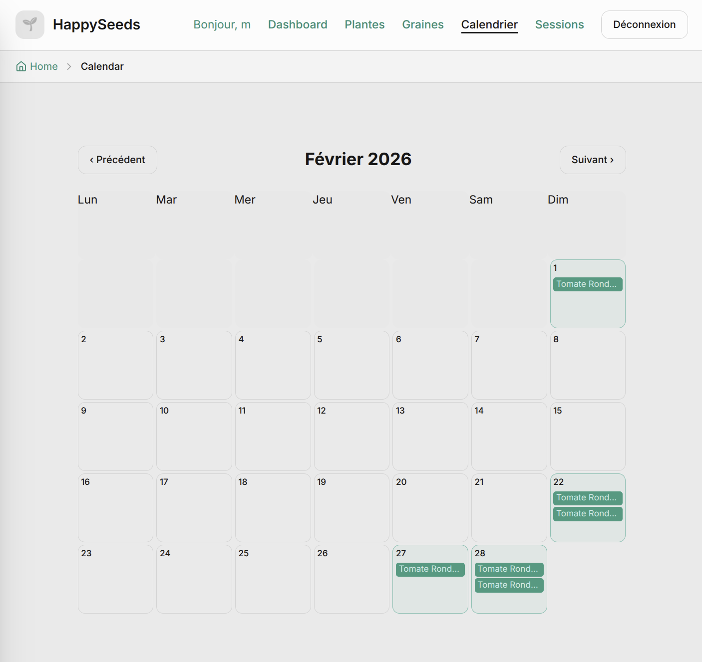
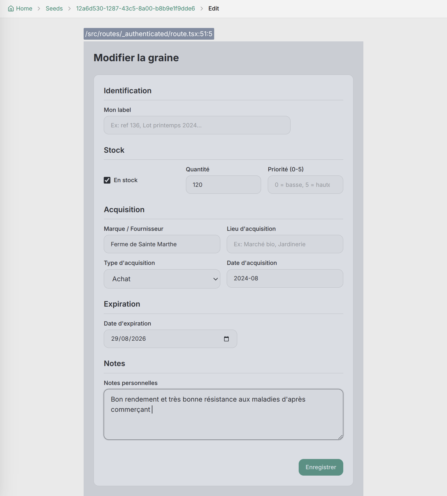
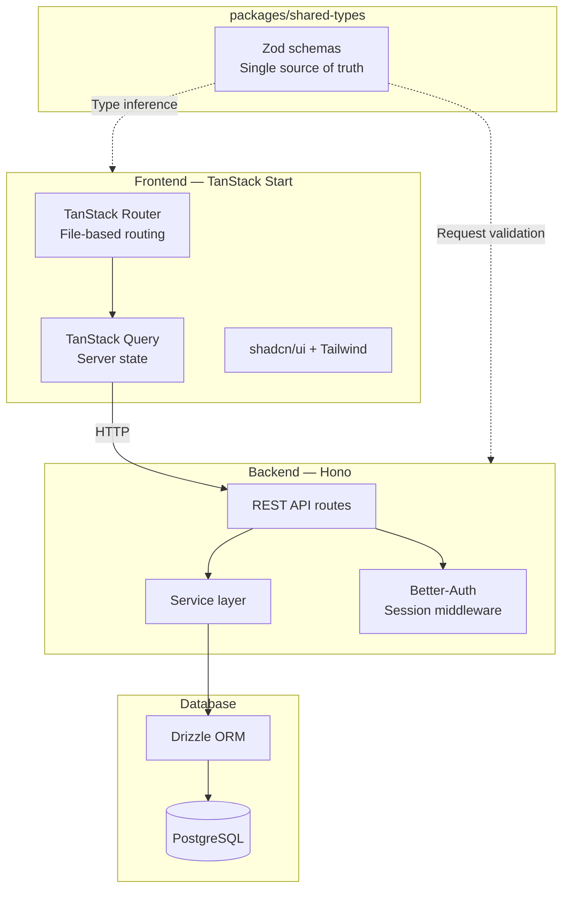

# HappySeeds

**Seed library management and sowing planning application.**

[]()
[]()
[]()
[]()
[](LICENSE)

> [Lire en francais](README.fr.md)

---

A personal fullstack web application for gardeners who want to catalog their seed collection, consult plant profiles, and plan their sowing calendar based on climate data.

> **Note:** This is a personal project under active development (alpha stage). Some features are still in progress.

## Screenshots

<table>
  <tr>
    <td></td>
    <td></td>
  </tr>
  <tr>
    <td></td>
    <td></td>
  </tr>
</table>

## Tech Stack

| Layer             | Technology                       |
| ----------------- | -------------------------------- |
| **Monorepo**      | Turborepo + pnpm                 |
| **Backend**       | Hono                             |
| **ORM**           | Drizzle ORM                      |
| **Database**      | PostgreSQL                       |
| **Auth**          | Better-Auth (session-based)      |
| **Frontend**      | TanStack Start + TanStack Router |
| **Data Fetching** | TanStack Query                   |
| **UI Components** | shadcn/ui + Radix UI             |
| **Styling**       | Tailwind CSS v4                  |
| **Validation**    | Zod (shared across stack)        |
| **Language**      | TypeScript (strict mode)         |

## Architecture



## Project Structure

```
happyseeds/
├── apps/
│   ├── backend/              # Hono API server
│   │   └── src/
│   │       ├── db/schemas/   # Drizzle table definitions
│   │       ├── routes/       # REST API endpoints
│   │       ├── services/     # Business logic
│   │       └── middleware/   # Auth middleware
│   └── frontend/             # TanStack Start app
│       └── src/
│           ├── routes/       # File-based routing
│           ├── components/   # UI components
│           ├── hooks/        # TanStack Query hooks
│           ├── services/     # API service layer
│           └── lib/          # Utilities
├── packages/
│   └── shared-types/         # Zod schemas shared across stack
└── scripts/                  # Tooling (import, release)
```

## Key Technical Decisions

This project deliberately favors technologies I hadn't used before — the goal was to learn by building, not to stay in my comfort zone.

**Turborepo monorepo** — Backend, frontend, and shared types live in one repository with unified linting, formatting, and type-checking. Shared Zod schemas provide end-to-end type safety: a single schema validates API requests on the server and infers TypeScript types on the client.

**TanStack Start + Router** — Chosen for its type-safe file-based routing and tight integration with TanStack Query. The TanStack ecosystem offered a modern, well-designed alternative built on battle-tested libraries (Query, Router, Form) rather than all-in-one frameworks.

**Drizzle ORM** — Lightweight, SQL-close approach with excellent TypeScript inference. Migrations are explicit SQL files, giving full control over the database schema — a more transparent workflow compared to Prisma's abstracted migration engine.

**Hono** — Ultra-fast, lightweight HTTP framework with native TypeScript support. Its middleware pattern integrates cleanly with Better-Auth for session-based authentication.

## Development Approach

This project was built with a custom AI-assisted learning methodology. I designed a `dev-mentor` skill — a set of rules that configures the AI as a **Socratic guide**: it explains concepts, reviews architectural decisions, asks probing questions, and points to relevant documentation, but **never writes code directly**.

Every line of code in this repository was written by hand. The AI served as a mentor, not a co-pilot.

This approach allowed me to deeply understand every technical choice while leveraging AI as a structured learning accelerator.

## Getting Started

### Prerequisites

- Node.js >= 18
- pnpm >= 10
- PostgreSQL

### Installation

```bash
# Clone the repository
git clone https://github.com/m1cm4/happyseeds.git
cd happyseeds

# Install dependencies
pnpm install

# Configure environment variables
cp apps/backend/.env.example apps/backend/.env
cp apps/frontend/.env.example apps/frontend/.env
# Edit .env files with your database credentials

# Run database migrations
cd apps/backend
pnpm drizzle-kit migrate
cd ../..

# Start development servers
pnpm dev
```

The frontend runs on `http://localhost:3000` and the API on `http://localhost:3001`.

## Roadmap

- [ ] Search functionality across plants and seeds
- [ ] Image upload in plant forms
- [ ] Pagination on list views
- [ ] Skeleton loaders for better loading experience
- [ ] SEO-friendly URLs (slugs instead of UUIDs)
- [ ] Expanded use cases and user workflows
- [ ] UI/UX redesign
- [ ] Visual design system
- [ ] AI-powered features (weather API, plant database, writing assistance)
- [ ] More tests (unit, integration, e2e)

## License

[MIT](LICENSE) — Michel Maes

## Contact

**Michel Maes** — Full Stack JS Developer | Front-End Designer

[](https://linkedin.com/in/mic-maes)
